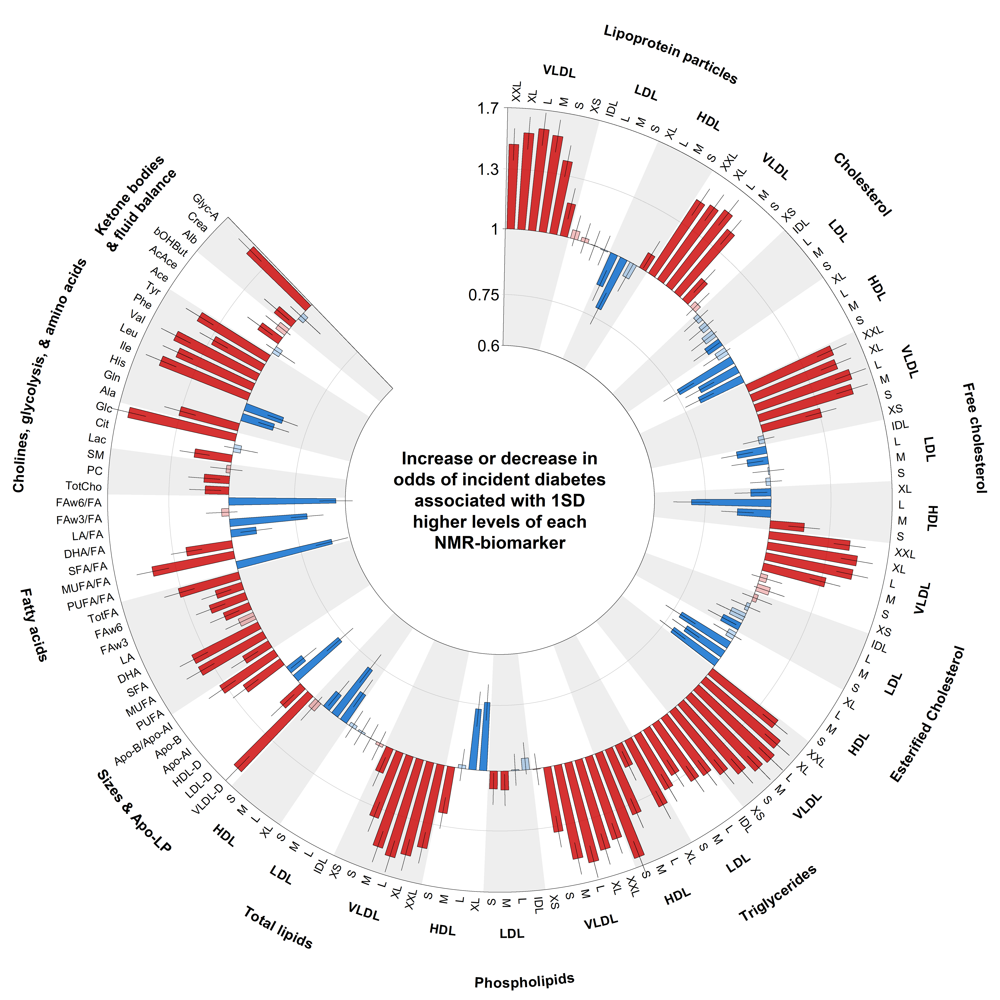

The following script produces a circular plot showing associations between NMR measured biomarkers and an outcome of interest (in this example, incident diabetes). These associations can be product of any generalised linear model that is of relevance for epidemiology such as linear regression, logistic regression, or Cox regression.  

The general structure of the SAS output datasource (usually in .csv) should go as follows:

id_name_s | text1     | Estimate | StdErr | WaldChiSq |
----------|-----------|----------|--------|-----------|
1         | XXL_VLDL_P|0.3709    |0.0358  |107.6032   |

Data should be sorted by `id_name_s`, which corresponds to the following biomarkers array as per `text1`:
```{r intro, echo=FALSE, message=FALSE, warning=FALSE }
ROOTDIR <- params$ROOTDIR
PREFIX <- "LR"  
OUTCOME <- "PRDM"  
GROUP <- "ALL"  
file.out <- "PRDM"  
fact <- "mets" 
datasub <<- read.csv(paste("", ROOTDIR ,"data\\",PREFIX,"_",OUTCOME,"_",GROUP,".csv", sep=""), skip=0, header=TRUE)
datasub$text1

```
**NOTE:** to keep the y-axis in the log-scale (to preserve the estimates in symmetrical and proportional distance from the null-hypothesis), parameters are (perhaps sometimes unsatisfactorily) constantly log transformed to then be back-transformed by exponentiating such parameters. This not only happens with the values contained in the SAS output datasets but also when defining axes, ticks, labels (as characters), and other situations. This might be confusing and I do apologise for that. Further versions will aim to clean an homogenise such inconsistencies.


## Install circlize
You can find the documentation for the package [here](https://jokergoo.github.io/circlize_book/book/).  
And download from [here](https://cran.r-project.org/src/contrib/circlize_0.4.8.tar.gz).


```{r package needed, echo=TRUE, message=FALSE, warning=FALSE}
library(circlize)
```

## 1. Prep to call data
Define dataset that will be called into R for plotting. 

```{r code1, echo=TRUE, message=FALSE, warning=FALSE}
ROOTDIR <- params$ROOTDIR
PREFIX <- "LR"  
OUTCOME <- "PRDM"  
GROUP <- "ALL"  
file.out <- "PRDM"  
fact <- "mets"  
```

`ROOTDIR`  = path to where data with results to plot is located. For this example, ROOTDIR is parametrised, and it should be adjusted to where datasource is located.  

`PREFIX` = Prefix from SAS output file name. I use LR = Logistic regression.  

`OUTCOME` = Substring from SAS output file name. I use PRDM = prospective or incident diabetes.  

`GROUP` = Substring from SAS output file name. I use ALL = as in all individuals included, but could be used to label stratified analyses or other subgroups of interest.  

`file.out` = Substring for the output file name.  

`fact` = String that can be changed. I randomly chose "mets".  

## 2. Import datasets
Using the objects define above, we now call the datasource with SAS output to create `datasub`.  

1. We exponentiate `Estimate` to create `RR`.  
2. We then create `RR_1<-RR` if `RR< 1` (*i.e. those with negative associations*), else `RR_1<-1`.   
3. We also then create `RR_2<-RR` if `RR>1` (*i.e. those with positive associations*), else `RR_2<-1`.    

```{r code2, echo=TRUE, message=FALSE, warning=FALSE, tidy=TRUE}

datasub <<- read.csv(paste("", ROOTDIR ,"data\\",PREFIX,"_",OUTCOME,"_",GROUP,".csv", sep=""), skip=0, header=TRUE)

# 1.
datasub$RR <- exp(datasub$Estimate)

# 2.
datasub$RR_1 <- datasub$RR
datasub$RR_1[datasub$RR>1] <- 1

# 3.
datasub$RR_2 <- datasub$RR
datasub$RR_2[datasub$RR<1] <- 1

```
## 3. Estimating *p-values*.
1. From SAS output now imported into `datasub`, estimate p-values from chisq statistics `datasub$RawP`.
2. Using the false discovery rate adjustment by Benjamini & Hochberg, `p.adjust` estimates adjusted p-values `datasub$AdjP`.
3. Then, adds flags for the metabolites with evidence against the null hypothesis bellow the fdr-adjusted "significance level".
4. We then create new vectors for estimates that are significant (suffix = `_s`). *NB, suffix `_1` is used for estimates with negative associations and suffix `_2` for estimates with positive associations.* We will add colours later (red for positive and blue for negative, darker shade for those below the significance threshold).
5. If flagged as *"non-significant"* then newly created vectors are transformed into 1 (the value for the null hypothesis).
6. If flagged as *"significant"* then original vectors are transformed into 1 (the value for the null hypothesis).
7. Estimates the number of metabolites based on de dimension of the dataset, necessary later.

```{r code3, echo=TRUE, message=FALSE, warning=FALSE}
# 1.
datasub$RawP <- pchisq(datasub$WaldChiSq, 1, lower.tail=FALSE)

# 2. 
datasub$AdjP <- p.adjust(datasub$RawP, method = "fdr")

# 3.
datasub$Sig<-NA
datasub$Sig[datasub$AdjP< 0.05] <- 1
datasub$Sig[datasub$AdjP>= 0.05] <- 0

# 4. 
datasub$RR_1_s <- datasub$RR_1
datasub$RR_2_s <- datasub$RR_2

# 5. 
datasub$RR_1_s[datasub$Sig==0] <- 1
datasub$RR_2_s[datasub$Sig==0] <- 1

# 6.
datasub$RR_1[datasub$Sig==1] <- 1
datasub$RR_2[datasub$Sig==1] <- 1

# 7.
len.data <<-  as.numeric(dim(datasub)[1])
```

## 4. Plotting parameters
In this section we input the parameters for the plotting areas and steps are taken to keep proportions. Importantly, **the measures to keep proportionality could be substantially improved.**

### Y-axis
1. `YLIM` `YCUTS` and `YCUTS.LABS` define the Y-axis. *Parameters here are defined manually but could be automated by extracting `MIN` and `MAX` and using the pretty function to define cuts and labels*.
2. Alternatively, one could define labels as percentage instead of relative risks, if desired.
3. `ylab` 1:3 define the levels for labels around the circular plot that are relative and proportional to the MAX and MIN of the axis.
4. If estimate is off limits from `YLIM` then estimates are trimmed. **Currently, the plot doesn't flag this transformation,** although it should be evident as the bar ends precisely at the limit of the axis and user should be aware as the axis limits are currently defined manually.

```{r code4, echo=TRUE, message=FALSE, warning=FALSE}
# 1.
YLIM <- c(log(0.6), log(1.7))
YCUTS <- c(log(0.6), log(0.75), log(1), log(1.3), log(1.7))
YCUTS.LABS <- as.character(exp(YCUTS))
YMAX <- exp(max(YLIM))
YMIN <- exp(min(YLIM))

# 2.
#YCUTS.LABS <- c("-40%", "-20%", "0%", "30%", "60%")

# 3.
ylab1 <- exp(log(YMAX)+log(YMAX)*0.05)
ylab2 <- exp(log(YMAX)+log(YMAX)*0.3)
ylab3 <- exp(log(YMAX)+log(YMAX)*0.7)
ylab3b <- exp(log(YMAX)+log(YMAX)*0.55)

# 4.
ADJ <- 0.01

datasub$RR_1[datasub$RR_1<=YMIN] <- YMIN+YMIN*ADJ
datasub$RR_2[datasub$RR_2>=YMAX] <- YMAX-YMAX*ADJ

datasub$RR_1_s[datasub$RR_1_s<=YMIN] <- YMIN+YMIN*ADJ
datasub$RR_2_s[datasub$RR_2_s>=YMAX] <- YMAX-YMAX*ADJ

datasub$Estimate[datasub$Estimate<=log(YMIN)] <- log(YMIN)+log(YMIN)*ADJ
datasub$Estimate[datasub$Estimate>=log(YMAX)] <- log(YMAX)-log(YMAX)*ADJ

```
### X-axis
**IMPORTANT** the x-axis is defined by the number of metabolic biomarkers. This number is currently **139** derived from `id_name_s`. All the labels are mapped around this number, and in this especific order. If the user decides a different array of biomarkers is needed (*i.e. only include lipids, or by lipid types instead of by lipoprotein sizes*), then this change can only currently be implemented in SAS and the mapping for labels should also be changed manually.


```{r code5, echo=TRUE, message=FALSE, warning=FALSE}
XLIM <- c(min(as.numeric(datasub$id_name_s)), max(as.numeric(datasub$id_name_s)))
```

### Labels
1. `labs1` Contains the lipoprotein subclass size acronyms. This is repeated 7 times, once per each measurement of interest (*i.e. lipoprotein particle number, cholesterol, free cholesterol, esterified cholesterol, triglycerides, phospholipids, and total lipids*).
2. `labs4` Vector with additional labels for the rest of biomarkers besides lipids within lipoproteins.
3. `CEX` states a vector to use for sizing. If user changes `CEX` (*with upper case*), then all those functions using CEX will be proportionally re-sized.  
**NOTE** if the user changes the array defining `id_name_s`, then this section should be changed accordingly.  

```{r code6, echo=TRUE, message=FALSE, warning=FALSE}

labs1 <- c(rep (c("XXL", "XL", "L", "M", "S", "XS", "IDL", "L", "M", "S", "XL", "L", "M", "S"), 7))

labs4 <- c("VLDL-D", "LDL-D", "HDL-D", "Apo-AI", "Apo-B", "Apo-B/Apo-AI",
           "PUFA", "MUFA", "SFA", "DHA", "LA", "FAw3", "FAw6", "TotFA",
           "PUFA/FA", "MUFA/FA", "SFA/FA", "DHA/FA", "LA/FA", "FAw3/FA", "FAw6/FA",
           "TotCho", "PC", "SM",
           "Lac", "Cit", "Glc",
           "Ala", "Gln", "His", "Ile", "Leu", "Val", "Phe", "Tyr",
           "Ace", "AcAce", "bOHBut",
           "Alb", "Crea", "Glyc-A")

CEX <- (8)
```

### Graphic device
We decided to use the png graphic device, but others such as pdf or tiff do the trick as well.  
1. The line we would use produces a filename that includes the `file.out` substring defined above as well as `GROUP` and the date.  
2. For this document, have named the output file `"foo.png"`.  
```{r code7, echo=TRUE, message=FALSE, warning=FALSE, eval=FALSE, tidy=TRUE}
# 1.
#png(paste("",ROOTDIR,"tables and figures\\" , file.out ," " , GROUP ," ", format(Sys.time(), " %Y-%m-%d"), " .png", sep=""), height=6000,width=6000, bg = "white")
# 2.
name <- "foo.png"
png(filename = name, height=6000,width=6000, bg = "white")
```

### Margins
The outer margins `OMA` are quite large (*29 spaces, in the 4 margins*), as we need space to place our labels.  
```{r code8, echo=TRUE, message=FALSE, warning=FALSE, eval=FALSE}
par(xpd = NA, oma = rep(29,4))
```


## 5. Circos function
This represents the core of the script, although most of the job is done above. It uses the *circlize* package but, as you will see, most of the basic R plot functions are preserved and only slightly changed.  

Importantly, this plot uses only very limitedly the applications of the *circlize* package. Some of the approaches I have had to make the plot are probably clumsy or redundant.  

I **highly** recommend to have a quick look into the [documentation](https://jokergoo.github.io/circlize_book/book/). It is simpler than it looks and relatively easy to work with.  

### Parameters
Circlize transforms a "Cartesian plane" with *x* and *y* axis into a *circle* of *y* radius and *x* circumference. Basically, a traditional rectangular plot is twisted into a donut. The *donut* is called *sector*. Sectors can be split in several tracks. You can add additional sectors or *donuts* in ever more central levels.  
  
**Our example only has 1 sector with 1 track.**  
`track.height` determines the proportion of the radius of the circle the track (where we are going to plot) is going to use. The circle used by circlize always has a radius of 1, so a height of 0.1 means 10% of the circle radius.   
`gap.degree` determines the space between the end of the track and the start of the track.  
`start.degree` determines the place to start the track at in degrees (count starts at the *West*).  

```{r code9, echo=TRUE, message=FALSE, warning=FALSE, eval=FALSE}
circos.par("track.height" = 0.6, 
           cell.padding = c(0, 0, 0, 0),
           gap.degree = 45,
           start.degree = 90,
           unit.circle.segments=50000)
```

### Initialize the circle
1. `circos.initialize` is the core function that determines the basic parameters. I am still not entirely sure how it works. However, a character object in the `factors` option (in this example `fact`) does the trick and this becomes the name of our *sector*.  
2. `xlim` is defined by the length of the `id_name_s` column, as noted above.  
```{r code10, echo=TRUE, message=FALSE, warning=FALSE, eval=FALSE}
# 1.
circos.initialize(factors = fact, xlim = c(0,len.data))

# 2.
circos.track(factors = fact, ylim = YLIM, bg.border = NA)
```

### Draw shades for metabolic subgroups

To highlight specific regions use *circlize()* to calculate the positions in the polar coordinate. Always keep in mind that *x-axis* in the cell are always clock wise.  

The highlight region to be calculated by `circlize()`needs coordinates in *x* and *y*, a `sector.index` (in this case `"mets"`), and a `track.index` (in this case `1`).  

**NOTE:** In this example, the coordinates were imputed manually and correspond to the array defined by `id_names_s`. If changed, this section must also be changed to preserve meaningful highlight regions.  


Unless the user wants to change the order of the biomarkers, this section needs no further details explained.  


```{r code11, echo=TRUE, message=FALSE, warning=FALSE, eval=FALSE}
pos1 = circlize(c(0.5, 6.5), c(min(YLIM), max(YLIM)), sector.index = "mets", track.index = 1)
draw.sector(pos1[1, "theta"], pos1[2, "theta"], pos1[1, "rou"], pos1[2, "rou"], clock.wise = TRUE, col = "#CCCCCC56", border = NA) 

pos2 = circlize(c(10.5, 14.5), c(min(YLIM), max(YLIM)), sector.index = "mets", track.index = 1)
draw.sector(pos2[1, "theta"], pos2[2, "theta"], pos2[1, "rou"], pos2[2, "rou"], clock.wise = TRUE, col = "#CCCCCC56", border = NA) 

pos3 = circlize(c(20.5, 24.5), c(min(YLIM), max(YLIM)), sector.index = "mets", track.index = 1)
draw.sector(pos3[1, "theta"], pos3[2, "theta"], pos3[1, "rou"], pos3[2, "rou"], clock.wise = TRUE, col = "#CCCCCC56", border = NA) 

pos4 = circlize(c(28.5, 34.5), c(min(YLIM), max(YLIM)), sector.index = "mets", track.index = 1)
draw.sector(pos4[1, "theta"], pos4[2, "theta"], pos4[1, "rou"], pos4[2, "rou"], clock.wise = TRUE, col = "#CCCCCC56", border = NA) 

pos5 = circlize(c(38.5, 42.5), c(min(YLIM), max(YLIM)), sector.index = "mets", track.index = 1)
draw.sector(pos5[1, "theta"], pos5[2, "theta"], pos5[1, "rou"], pos5[2, "rou"], clock.wise = TRUE, col = "#CCCCCC56", border = NA) 

pos6 = circlize(c(48.5, 52.5), c(min(YLIM), max(YLIM)), sector.index = "mets", track.index = 1)
draw.sector(pos6[1, "theta"], pos6[2, "theta"], pos6[1, "rou"], pos6[2, "rou"], clock.wise = TRUE, col = "#CCCCCC56", border = NA) 

pos7 = circlize(c(56.5, 62.5), c(min(YLIM), max(YLIM)), sector.index = "mets", track.index = 1)
draw.sector(pos7[1, "theta"], pos7[2, "theta"], pos7[1, "rou"], pos7[2, "rou"], clock.wise = TRUE, col = "#CCCCCC56", border = NA) 

pos8 = circlize(c(66.5, 70.5), c(min(YLIM), max(YLIM)), sector.index = "mets", track.index = 1)
draw.sector(pos8[1, "theta"], pos8[2, "theta"], pos8[1, "rou"], pos8[2, "rou"], clock.wise = TRUE, col = "#CCCCCC56", border = NA) 

pos9 = circlize(c(76.5, 80.5), c(min(YLIM), max(YLIM)), sector.index = "mets", track.index = 1)
draw.sector(pos9[1, "theta"], pos9[2, "theta"], pos9[1, "rou"], pos9[2, "rou"], clock.wise = TRUE, col = "#CCCCCC56", border = NA) 

pos10 = circlize(c(84.5, 90.5), c(min(YLIM), max(YLIM)), sector.index = "mets", track.index = 1)
draw.sector(pos10[1, "theta"], pos10[2, "theta"], pos10[1, "rou"], pos10[2, "rou"], clock.wise = TRUE, col = "#CCCCCC56", border = NA) 

pos11 = circlize(c(94.5, 98.5), c(min(YLIM), max(YLIM)), sector.index = "mets", track.index = 1)
draw.sector(pos11[1, "theta"], pos11[2, "theta"], pos11[1, "rou"], pos11[2, "rou"], clock.wise = TRUE, col = "#CCCCCC56", border = NA) 

pos12 = circlize(c(104.5, 112.5), c(min(YLIM), max(YLIM)), sector.index = "mets", track.index = 1)
draw.sector(pos12[1, "theta"], pos12[2, "theta"], pos12[1, "rou"], pos12[2, "rou"], clock.wise = TRUE, col = "#CCCCCC56", border = NA) 

pos13 = circlize(c(119.5, 122.5), c(min(YLIM), max(YLIM)), sector.index = "mets", track.index = 1)
draw.sector(pos13[1, "theta"], pos13[2, "theta"], pos13[1, "rou"], pos13[2, "rou"], clock.wise = TRUE, col = "#CCCCCC56", border = NA) 

pos14 = circlize(c(125.5, 133.5), c(min(YLIM), max(YLIM)), sector.index = "mets", track.index = 1)
draw.sector(pos14[1, "theta"], pos14[2, "theta"], pos14[1, "rou"], pos14[2, "rou"], clock.wise = TRUE, col = "#CCCCCC56", border = NA) 

pos15 = circlize(c(136.5, 139.5), c(min(YLIM), max(YLIM)), sector.index = "mets", track.index = 1)
draw.sector(pos15[1, "theta"], pos15[2, "theta"], pos15[1, "rou"], pos15[2, "rou"], clock.wise = TRUE, col = "#CCCCCC56", border = NA) 
```

### Plotting region

1. Using `circos.track`, we select track `1`, using factors defined in object `fact`, and the `YLIM` defined above.  
2. We use `circos.segmets` exactly as `segments` would be used to create:  
   i) Start and end of plot lines.  
   ii) Outer and inner lines.  
   iii) Lines at null hypotesis and other cuts.  
```{r code12, echo=TRUE, message=FALSE, warning=FALSE, eval=FALSE}
# 1.
circos.track(track.index = 1, bg.border = "white", factors = fact, ylim = YLIM, panel.fun = function(x,y){

# i)
# Start 
circos.segments(x0=min(XLIM)-0.5, y0=max(YLIM), x1=min(XLIM)-0.5, y1=min(YLIM), col = "black", lwd=2)
# End 
circos.segments(x0=max(XLIM)+0.5, y0=max(YLIM), x1=max(XLIM)+0.5, y1=min(YLIM), col = "black", lwd=2)

# ii)
# Outer
circos.segments(x0=min(XLIM)-.75, y0=max(YLIM), x1=max(XLIM)+0.5, y1=max(YLIM), col = "black", lwd=2)
# Inner
circos.segments(x0=min(XLIM)-.75, y0=min(YLIM), x1=max(XLIM)+0.5, y1=min(YLIM), col = "black", lwd=2)

# iii)
# Lines at YCUTS
# Null Hypothesis
circos.segments(x0=min(XLIM)-.75, y0=0, x1=max(XLIM)+0.5, y1=0, col = "black", lwd=2)
circos.segments(x0=min(XLIM)-.75, y0=(YCUTS[2]), x1=max(XLIM)+0.5, y1=(YCUTS[2]), col = "gray75", lwd=2)
circos.segments(x0=min(XLIM)-.75, y0=(YCUTS[4]), x1=max(XLIM)+0.5, y1=(YCUTS[4]), col = "gray75", lwd=2)
```

### Draw bars with estimates
`circos.rect` draws a rectangle of `xleft`, `xright`, `ytop`, and `ybottom` dimentions.  

Each bar is defined in the *x* axis by its position withing `is_name_s`. Width is defined by simply substracting or adding 0.35 to the coordinates in `xleft` and `xright`, respectively. 

Each bar of the 4 types of bars are defined in the *y* axis by the value in one of the four `RR` vectors created above, based on the following:  

1. Positive and "significant", in dark red (i.e. `RR_2_s`).  
2. Positive and not "significant", in light red (i.e. `RR_2`).  
3. Negative and "significant", in dark blue (i.e. `RR_1_s`).  
4. Negative and "non-significant", in light blue (i.e. `RR_1`).  

Colours are defined in hex with the last 2 digits defining transparency.

```{r code13, echo=TRUE, message=FALSE, warning=FALSE, eval=FALSE}
# Bars
# 1.
circos.rect(xleft=(as.numeric(datasub$id_name_s)-.35), xright=(as.numeric(datasub$id_name_s)+.35), ytop=log(as.numeric(datasub$RR_2_s)), ybottom = log(1), col = "#CC0000CC" , lwd=2)
# 2.
circos.rect(xleft=(as.numeric(datasub$id_name_s)-.35), xright=(as.numeric(datasub$id_name_s)+.35), ytop=log(as.numeric(datasub$RR_2)), ybottom = log(1), col = "#CC000040" , lwd=2)
# 3.
circos.rect(xleft=(as.numeric(datasub$id_name_s)-.35), xright=(as.numeric(datasub$id_name_s)+.35),ytop=log(as.numeric(datasub$RR_1_s)), ybottom = log(1), col = "#0066CCCC" , lwd=2)
# 4.
circos.rect(xleft=(as.numeric(datasub$id_name_s)-.35), xright=(as.numeric(datasub$id_name_s)+.35), ytop=log(as.numeric(datasub$RR_1)), ybottom = log(1), col = "#0066CC40" , lwd=2)
```


### Draw confidence intervals
Also using `circos.rect` draw confidence intervals out of `StdErr`.  

**NOTE:** This chunk must be plotted after the bars, so the graphic device can draw the confidence intervals on top.  

```{r code14, echo=TRUE, message=FALSE, warning=FALSE, eval=FALSE}
# Confidence intervals
circos.rect(xleft=(as.numeric(datasub$id_name_s)), xright=(as.numeric(datasub$id_name_s)), ytop=(as.numeric(datasub$Estimate)+(1.95*as.numeric(datasub$StdErr))), ybottom = (as.numeric(datasub$Estimate)-(1.95*(as.numeric(datasub$StdErr)))), col = "#262626" , lwd=2)
```

Another useful option is `circos.points`, which allows to draw blobs with the basic R `pch` options.  

### Draw y-axis
Similar to basic R plotting axis options.  
```{r code15, echo=TRUE, message=FALSE, warning=FALSE, eval=FALSE}
circos.yaxis(at=YCUTS, labels = YCUTS.LABS, labels.cex = CEX*1, tick = FALSE, col = "white")
```

### Draw labels

We use the function `circos.text` to paste the labels at the margins of the plot (remember we left a lot of space at the margins when defining the plot `par` above). 

The option `facing` defines how to paste the labels. The package has several options that make text look nicely, including `niceFacing`, which makes text flip so it can be read easily.  

The positions for labels are, unfortunately, very inefficiently defined manually.  

All the `.shift` objects were used to manually adjust the labels. These work now, but maybe play with them to see how the labels move.  

```{r code16, echo=TRUE, message=FALSE, warning=FALSE, eval=FALSE}
VLDL.shift <- 2 
LDL.shift <- 1.5
HDL.shift <- 1.5

circos.text(x=0.5+5, y=log(ylab3), facing = "bending.inside", niceFacing = TRUE, labels = "Lipoprotein particles", cex = CEX*0.9, adj=0, font=2)
circos.text(x=0.5+VLDL.shift, y=log(ylab2), facing = "bending.inside", niceFacing = TRUE, labels = "VLDL", cex = CEX*0.8, adj=0, font=2)
circos.text(x=6.5+LDL.shift, y=log(ylab2), facing = "bending.inside", niceFacing = TRUE, labels = "LDL", cex = CEX*0.8, adj=0, font=2)
circos.text(x=10.5+HDL.shift, y=log(ylab2), facing = "bending.inside", niceFacing = TRUE, labels = "HDL", cex = CEX*0.8, adj=0, font=2) 

circos.text(x=14.5+5, y=log(ylab3), facing = "bending.inside", niceFacing = TRUE, labels = "Cholesterol", cex = CEX*0.9, adj=0, font=2)
circos.text(x=14.5+VLDL.shift, y=log(ylab2), facing = "bending.inside", niceFacing = TRUE, labels = "VLDL", cex = CEX*0.8, adj=0, font=2)
circos.text(x=20.5+LDL.shift, y=log(ylab2), facing = "bending.inside", niceFacing = TRUE, labels = "LDL", cex = CEX*0.8, adj=0, font=2)
circos.text(x=24.5+HDL.shift, y=log(ylab2), facing = "bending.inside", niceFacing = TRUE, labels = "HDL", cex = CEX*0.8, adj=0, font=2) 

circos.text(x=28.5+5, y=log(ylab3), facing = "bending.inside", niceFacing = TRUE, labels = "Free cholesterol", cex = CEX*0.9, adj=0, font=2)
circos.text(x=28.5+VLDL.shift, y=log(ylab2), facing = "bending.inside", niceFacing = TRUE, labels = "VLDL", cex = CEX*0.8, adj=0, font=2)
circos.text(x=34.5+LDL.shift, y=log(ylab2), facing = "bending.inside", niceFacing = TRUE, labels = "LDL", cex = CEX*0.8, adj=0, font=2)
circos.text(x=38.5+HDL.shift, y=log(ylab2), facing = "bending.inside", niceFacing = FALSE, labels = "HDL", cex = CEX*0.8, adj=0, font=2) 

circos.text(x=42.5+5, y=log(ylab3), facing = "bending.inside", niceFacing = TRUE, labels = "Esterified Cholesterol", cex = CEX*0.9, adj=0, font=2)
circos.text(x=42.5+VLDL.shift, y=log(ylab2), facing = "bending.inside", niceFacing = TRUE, labels = "VLDL", cex = CEX*0.8, adj=0, font=2)
circos.text(x=48.5+LDL.shift, y=log(ylab2), facing = "bending.inside", niceFacing = TRUE, labels = "LDL", cex = CEX*0.8, adj=0, font=2)
circos.text(x=52.5+HDL.shift, y=log(ylab2), facing = "bending.inside", niceFacing = TRUE, labels = "HDL", cex = CEX*0.8, adj=0, font=2) 

circos.text(x=56.5+5, y=log(ylab3), facing = "bending.inside", niceFacing = TRUE, labels = "Triglycerides", cex = CEX*0.9, adj=0, font=2)
circos.text(x=56.5+VLDL.shift, y=log(ylab2), facing = "bending.inside", niceFacing = TRUE, labels = "VLDL", cex = CEX*0.8, adj=0, font=2)
circos.text(x=62.5+LDL.shift, y=log(ylab2), facing = "bending.inside", niceFacing = TRUE, labels = "LDL", cex = CEX*0.8, adj=0, font=2)
circos.text(x=66.5+HDL.shift, y=log(ylab2), facing = "bending.inside", niceFacing = TRUE, labels = "HDL", cex = CEX*0.8, adj=0, font=2) 

circos.text(x=70.5+5, y=log(ylab3), facing = "bending.inside", niceFacing = TRUE, labels = "Phospholipids", cex = CEX*0.9, adj=0, font=2)
circos.text(x=70.5+VLDL.shift, y=log(ylab2), facing = "bending.inside", niceFacing = TRUE, labels = "VLDL", cex = CEX*0.8, adj=0, font=2)
circos.text(x=76.5+LDL.shift, y=log(ylab2), facing = "bending.inside", niceFacing = TRUE, labels = "LDL", cex = CEX*0.8, adj=0, font=2)
circos.text(x=80.5+HDL.shift, y=log(ylab2), facing = "bending.inside", niceFacing = TRUE, labels = "HDL", cex = CEX*0.8, adj=0, font=2) 

circos.text(x=84.5+5, y=log(ylab3), facing = "bending.inside", niceFacing = TRUE, labels = "Total lipids", cex = CEX*0.9, adj=0, font=2)
circos.text(x=84.5+VLDL.shift, y=log(ylab2), facing = "bending.inside", niceFacing = TRUE, labels = "VLDL", cex = CEX*0.8, adj=0, font=2)
circos.text(x=90.5+LDL.shift, y=log(ylab2), facing = "bending.inside", niceFacing = TRUE, labels = "LDL", cex = CEX*0.8, adj=0, font=2)
circos.text(x=94.5+HDL.shift, y=log(ylab2), facing = "bending.inside", niceFacing = TRUE, labels = "HDL", cex = CEX*0.8, adj=0, font=2) 

circos.text(x=98.5, y=log(ylab3), facing = "bending.inside", niceFacing = TRUE, labels = "Sizes & Apo-LP", cex = CEX*0.9, adj=0, font=2)

circos.text(x=104.5+6, y=log(ylab3), facing = "bending.inside", niceFacing = TRUE, labels = "Fatty acids", cex = CEX*0.9, adj=0, font=2)

circos.text(x=119.5, y=log(ylab3), facing = "bending.inside", niceFacing = TRUE, labels = "Cholines, glycolysis, & amino acids", cex = CEX*0.9, adj=0, font=2)

circos.text(x=133.5, y=log(ylab3), facing = "bending.inside", niceFacing = TRUE, labels = "  Ketone bodies", cex = CEX*0.9, adj=0, font=2)
circos.text(x=133.5, y=log(ylab3b), facing = "bending.inside", niceFacing = TRUE, labels = "& fluid balance", cex = CEX*0.9, adj=0, font=2)

circos.text(x=c(1:98)+0.25,   y = log(ylab1), labels = labs1, facing = "clockwise", niceFacing = TRUE, cex = CEX*0.7, adj = 0, font = 1)
circos.text(x=c(99:139)+0.25, y = log(ylab1), labels = labs4, facing = "clockwise", niceFacing = TRUE, cex = CEX*0.7, adj = 0, font = 1)
               
               
             }
             
)
```

### Title
Paste the title at the centre of the circle (at `x=0, y=0`).  

Use `circos.clear` to reset the circular layout parameters.  

Close the plotting device with `dev.off()`.

```{r code17, echo=TRUE, message=FALSE, warning=FALSE, eval=FALSE}
text(0, 0, paste("Increase or decrease in\nodds of incident diabetes\nassociated with 1SD\nhigher levels of each\nNMR-biomarker"), cex = CEX*1.1, font=2)

circos.clear()  

dev.off()


```
# 6. Output
```{r plot, echo=FALSE, message=FALSE, warning=FALSE}
# 1.
#png(paste("",ROOTDIR,"tables and figures\\" , file.out ," " , GROUP ," ", format(Sys.time(), " %Y-%m-%d"), " .png", sep=""), height=6000,width=6000, bg = "white")
# 2.
name <- "foo.png"
png(filename = name, height=6000,width=6000, bg = "white")

#png("1.png", height=6000,width=6000, bg = "white")

par(xpd = NA, oma = rep(29,4))
circos.par("track.height" = 0.6, 
           cell.padding = c(0, 0, 0, 0),
           gap.degree = 45,
           start.degree = 90,
           unit.circle.segments=50000) # We set a global parameter track.height to 0.1 by the option function circis.par() so that all tracks which will be added have a default height of 0.1. The circle used by circlize always has a radius of 1, so a height of 0.1 means 10% of the circle radius 


circos.initialize(factors = fact, xlim = c(0,len.data))

circos.track(factors = fact, ylim = YLIM, bg.border = NA)

# Draw highlights for sections of interest here
pos1 = circlize(c(0.5, 6.5), c(min(YLIM), max(YLIM)), sector.index = "mets", track.index = 1)
draw.sector(pos1[1, "theta"], pos1[2, "theta"], pos1[1, "rou"], pos1[2, "rou"], clock.wise = TRUE, col = "#CCCCCC56", border = NA) 

pos2 = circlize(c(10.5, 14.5), c(min(YLIM), max(YLIM)), sector.index = "mets", track.index = 1)
draw.sector(pos2[1, "theta"], pos2[2, "theta"], pos2[1, "rou"], pos2[2, "rou"], clock.wise = TRUE, col = "#CCCCCC56", border = NA) 

pos3 = circlize(c(20.5, 24.5), c(min(YLIM), max(YLIM)), sector.index = "mets", track.index = 1)
draw.sector(pos3[1, "theta"], pos3[2, "theta"], pos3[1, "rou"], pos3[2, "rou"], clock.wise = TRUE, col = "#CCCCCC56", border = NA) 

pos4 = circlize(c(28.5, 34.5), c(min(YLIM), max(YLIM)), sector.index = "mets", track.index = 1)
draw.sector(pos4[1, "theta"], pos4[2, "theta"], pos4[1, "rou"], pos4[2, "rou"], clock.wise = TRUE, col = "#CCCCCC56", border = NA) 

pos5 = circlize(c(38.5, 42.5), c(min(YLIM), max(YLIM)), sector.index = "mets", track.index = 1)
draw.sector(pos5[1, "theta"], pos5[2, "theta"], pos5[1, "rou"], pos5[2, "rou"], clock.wise = TRUE, col = "#CCCCCC56", border = NA) 

pos6 = circlize(c(48.5, 52.5), c(min(YLIM), max(YLIM)), sector.index = "mets", track.index = 1)
draw.sector(pos6[1, "theta"], pos6[2, "theta"], pos6[1, "rou"], pos6[2, "rou"], clock.wise = TRUE, col = "#CCCCCC56", border = NA) 

pos7 = circlize(c(56.5, 62.5), c(min(YLIM), max(YLIM)), sector.index = "mets", track.index = 1)
draw.sector(pos7[1, "theta"], pos7[2, "theta"], pos7[1, "rou"], pos7[2, "rou"], clock.wise = TRUE, col = "#CCCCCC56", border = NA) 

pos8 = circlize(c(66.5, 70.5), c(min(YLIM), max(YLIM)), sector.index = "mets", track.index = 1)
draw.sector(pos8[1, "theta"], pos8[2, "theta"], pos8[1, "rou"], pos8[2, "rou"], clock.wise = TRUE, col = "#CCCCCC56", border = NA) 

pos9 = circlize(c(76.5, 80.5), c(min(YLIM), max(YLIM)), sector.index = "mets", track.index = 1)
draw.sector(pos9[1, "theta"], pos9[2, "theta"], pos9[1, "rou"], pos9[2, "rou"], clock.wise = TRUE, col = "#CCCCCC56", border = NA) 

pos10 = circlize(c(84.5, 90.5), c(min(YLIM), max(YLIM)), sector.index = "mets", track.index = 1)
draw.sector(pos10[1, "theta"], pos10[2, "theta"], pos10[1, "rou"], pos10[2, "rou"], clock.wise = TRUE, col = "#CCCCCC56", border = NA) 

pos11 = circlize(c(94.5, 98.5), c(min(YLIM), max(YLIM)), sector.index = "mets", track.index = 1)
draw.sector(pos11[1, "theta"], pos11[2, "theta"], pos11[1, "rou"], pos11[2, "rou"], clock.wise = TRUE, col = "#CCCCCC56", border = NA) 

pos12 = circlize(c(104.5, 112.5), c(min(YLIM), max(YLIM)), sector.index = "mets", track.index = 1)
draw.sector(pos12[1, "theta"], pos12[2, "theta"], pos12[1, "rou"], pos12[2, "rou"], clock.wise = TRUE, col = "#CCCCCC56", border = NA) 

pos13 = circlize(c(119.5, 122.5), c(min(YLIM), max(YLIM)), sector.index = "mets", track.index = 1)
draw.sector(pos13[1, "theta"], pos13[2, "theta"], pos13[1, "rou"], pos13[2, "rou"], clock.wise = TRUE, col = "#CCCCCC56", border = NA) 

pos14 = circlize(c(125.5, 133.5), c(min(YLIM), max(YLIM)), sector.index = "mets", track.index = 1)
draw.sector(pos14[1, "theta"], pos14[2, "theta"], pos14[1, "rou"], pos14[2, "rou"], clock.wise = TRUE, col = "#CCCCCC56", border = NA) 

pos15 = circlize(c(136.5, 139.5), c(min(YLIM), max(YLIM)), sector.index = "mets", track.index = 1)
draw.sector(pos15[1, "theta"], pos15[2, "theta"], pos15[1, "rou"], pos15[2, "rou"], clock.wise = TRUE, col = "#CCCCCC56", border = NA) 

circos.track(track.index = 1, bg.border = "white", factors = fact, ylim = YLIM
             , panel.fun = function(x,y){
               
               # Start of plot line
               circos.segments(x0=min(XLIM)-0.5, y0=max(YLIM), x1=min(XLIM)-0.5, y1=min(YLIM), col = "black", lwd=2)
               # End of plot line
               circos.segments(x0=max(XLIM)+0.5, y0=max(YLIM), x1=max(XLIM)+0.5, y1=min(YLIM), col = "black", lwd=2)
               
               # Outer black line
               circos.segments(x0=min(XLIM)-.75, y0=max(YLIM), x1=max(XLIM)+0.5, y1=max(YLIM), col = "black", lwd=2)
               # Inner black line
               circos.segments(x0=min(XLIM)-.75, y0=min(YLIM), x1=max(XLIM)+0.5, y1=min(YLIM), col = "black", lwd=2)
               
               # Null Hypothesis Line (ie RR = 1) black line
               circos.segments(x0=min(XLIM)-.75, y0=0, x1=max(XLIM)+0.5, y1=0, col = "black", lwd=2)
               
               circos.segments(x0=min(XLIM)-.75, y0=(YCUTS[2]), x1=max(XLIM)+0.5, y1=(YCUTS[2]), col = "gray75", lwd=2)
               circos.segments(x0=min(XLIM)-.75, y0=(YCUTS[4]), x1=max(XLIM)+0.5, y1=(YCUTS[4]), col = "gray75", lwd=2)
               
               
               # # Bars
               circos.rect(xleft=(as.numeric(datasub$id_name_s)-.35), xright=(as.numeric(datasub$id_name_s)+.35), ytop=log(as.numeric(datasub$RR_1_s)), ybottom = log(1), col = "#0066CCCC" , lwd=2)
               circos.rect(xleft=(as.numeric(datasub$id_name_s)-.35), xright=(as.numeric(datasub$id_name_s)+.35), ytop=log(as.numeric(datasub$RR_2_s)), ybottom = log(1), col = "#CC0000CC" , lwd=2)
               
               circos.rect(xleft=(as.numeric(datasub$id_name_s)-.35), xright=(as.numeric(datasub$id_name_s)+.35), ytop=log(as.numeric(datasub$RR_1)), ybottom = log(1), col = "#0066CC40" , lwd=2)
               circos.rect(xleft=(as.numeric(datasub$id_name_s)-.35), xright=(as.numeric(datasub$id_name_s)+.35), ytop=log(as.numeric(datasub$RR_2)), ybottom = log(1), col = "#CC000040" , lwd=2)
               
               
               # 
               # Confidence intervals
               circos.rect(xleft=(as.numeric(datasub$id_name_s)), xright=(as.numeric(datasub$id_name_s)), ytop=(as.numeric(datasub$Estimate)+(1.95*as.numeric(datasub$StdErr))), ybottom = (as.numeric(datasub$Estimate)-(1.95*(as.numeric(datasub$StdErr)))), col = "#262626" , lwd=2)
               
               # Blobs 
               # circos.rect(xleft=(as.numeric(datasub$id_name_s)-.15), xright=(as.numeric(datasub$id_name_s)+.15), ytop=log(as.numeric(datasub$RR.x)), ybottom = log(as.numeric(datasub$RR.y)), col = "grey75" , lwd=0.0001)
               
               # # BLUE = WITHOUT DIABETES
               # circos.rect  (xleft=(as.numeric(datasub$id_name_s)-.20), xright=(as.numeric(datasub$id_name_s)-.20), ytop=(as.numeric(datasub$Estimate.x)+(1.95*as.numeric(datasub$StdErr.x))), ybottom = (as.numeric(datasub$Estimate.x)-(1.95*(as.numeric(datasub$StdErr.x)))), col = "#0066CC40" , lwd=2)
               # circos.points(x=as.numeric(datasub$id_name_s)-.20, y=log(as.numeric(datasub$RR.x)), pch = 16, col = "#0066CCE6", cex = 7)
               # 
               # # BLUE = WITHOUT DIABETES
               # circos.rect  (xleft=(as.numeric(datasub$id_name_s)+.20), xright=(as.numeric(datasub$id_name_s)+.20), ytop=(as.numeric(datasub$Estimate.y)+(1.95*as.numeric(datasub$StdErr.y))), ybottom = (as.numeric(datasub$Estimate.y)-(1.95*(as.numeric(datasub$StdErr.y)))), col = "#CC000040" , lwd=2)
               # circos.points(x=as.numeric(datasub$id_name_s)+.20, y=log(as.numeric(datasub$RR.y)), pch = 16, col = "#CC0000E6", cex = 7)
               # 
               
               VLDL.shift <- 2 
               LDL.shift <- 1.5
               HDL.shift <- 1.5
               
               circos.yaxis(at=YCUTS, labels = YCUTS.LABS, labels.cex = CEX*1, tick = FALSE, col = "white")
               
               circos.text(x=0.5+5, y=log(ylab3), facing = "bending.inside", niceFacing = TRUE, labels = "Lipoprotein particles", cex = CEX*0.9, adj=0, font=2)
               circos.text(x=0.5+VLDL.shift, y=log(ylab2), facing = "bending.inside", niceFacing = TRUE, labels = "VLDL", cex = CEX*0.8, adj=0, font=2)
               circos.text(x=6.5+LDL.shift, y=log(ylab2), facing = "bending.inside", niceFacing = TRUE, labels = "LDL", cex = CEX*0.8, adj=0, font=2)
               circos.text(x=10.5+HDL.shift, y=log(ylab2), facing = "bending.inside", niceFacing = TRUE, labels = "HDL", cex = CEX*0.8, adj=0, font=2) 
               
               circos.text(x=14.5+5, y=log(ylab3), facing = "bending.inside", niceFacing = TRUE, labels = "Cholesterol", cex = CEX*0.9, adj=0, font=2)
               circos.text(x=14.5+VLDL.shift, y=log(ylab2), facing = "bending.inside", niceFacing = TRUE, labels = "VLDL", cex = CEX*0.8, adj=0, font=2)
               circos.text(x=20.5+LDL.shift, y=log(ylab2), facing = "bending.inside", niceFacing = TRUE, labels = "LDL", cex = CEX*0.8, adj=0, font=2)
               circos.text(x=24.5+HDL.shift, y=log(ylab2), facing = "bending.inside", niceFacing = TRUE, labels = "HDL", cex = CEX*0.8, adj=0, font=2) 
               
               circos.text(x=28.5+5, y=log(ylab3), facing = "bending.inside", niceFacing = TRUE, labels = "Free cholesterol", cex = CEX*0.9, adj=0, font=2)
               circos.text(x=28.5+VLDL.shift, y=log(ylab2), facing = "bending.inside", niceFacing = TRUE, labels = "VLDL", cex = CEX*0.8, adj=0, font=2)
               circos.text(x=34.5+LDL.shift, y=log(ylab2), facing = "bending.inside", niceFacing = TRUE, labels = "LDL", cex = CEX*0.8, adj=0, font=2)
               circos.text(x=38.5+HDL.shift, y=log(ylab2), facing = "bending.inside", niceFacing = FALSE, labels = "HDL", cex = CEX*0.8, adj=0, font=2) 
               
               circos.text(x=42.5+5, y=log(ylab3), facing = "bending.inside", niceFacing = TRUE, labels = "Esterified Cholesterol", cex = CEX*0.9, adj=0, font=2)
               circos.text(x=42.5+VLDL.shift, y=log(ylab2), facing = "bending.inside", niceFacing = TRUE, labels = "VLDL", cex = CEX*0.8, adj=0, font=2)
               circos.text(x=48.5+LDL.shift, y=log(ylab2), facing = "bending.inside", niceFacing = TRUE, labels = "LDL", cex = CEX*0.8, adj=0, font=2)
               circos.text(x=52.5+HDL.shift, y=log(ylab2), facing = "bending.inside", niceFacing = TRUE, labels = "HDL", cex = CEX*0.8, adj=0, font=2) 
               
               circos.text(x=56.5+5, y=log(ylab3), facing = "bending.inside", niceFacing = TRUE, labels = "Triglycerides", cex = CEX*0.9, adj=0, font=2)
               circos.text(x=56.5+VLDL.shift, y=log(ylab2), facing = "bending.inside", niceFacing = TRUE, labels = "VLDL", cex = CEX*0.8, adj=0, font=2)
               circos.text(x=62.5+LDL.shift, y=log(ylab2), facing = "bending.inside", niceFacing = TRUE, labels = "LDL", cex = CEX*0.8, adj=0, font=2)
               circos.text(x=66.5+HDL.shift, y=log(ylab2), facing = "bending.inside", niceFacing = TRUE, labels = "HDL", cex = CEX*0.8, adj=0, font=2) 
               
               circos.text(x=70.5+5, y=log(ylab3), facing = "bending.inside", niceFacing = TRUE, labels = "Phospholipids", cex = CEX*0.9, adj=0, font=2)
               circos.text(x=70.5+VLDL.shift, y=log(ylab2), facing = "bending.inside", niceFacing = TRUE, labels = "VLDL", cex = CEX*0.8, adj=0, font=2)
               circos.text(x=76.5+LDL.shift, y=log(ylab2), facing = "bending.inside", niceFacing = TRUE, labels = "LDL", cex = CEX*0.8, adj=0, font=2)
               circos.text(x=80.5+HDL.shift, y=log(ylab2), facing = "bending.inside", niceFacing = TRUE, labels = "HDL", cex = CEX*0.8, adj=0, font=2) 
               
               circos.text(x=84.5+5, y=log(ylab3), facing = "bending.inside", niceFacing = TRUE, labels = "Total lipids", cex = CEX*0.9, adj=0, font=2)
               circos.text(x=84.5+VLDL.shift, y=log(ylab2), facing = "bending.inside", niceFacing = TRUE, labels = "VLDL", cex = CEX*0.8, adj=0, font=2)
               circos.text(x=90.5+LDL.shift, y=log(ylab2), facing = "bending.inside", niceFacing = TRUE, labels = "LDL", cex = CEX*0.8, adj=0, font=2)
               circos.text(x=94.5+HDL.shift, y=log(ylab2), facing = "bending.inside", niceFacing = TRUE, labels = "HDL", cex = CEX*0.8, adj=0, font=2) 
               
               circos.text(x=98.5, y=log(ylab3), facing = "bending.inside", niceFacing = TRUE, labels = "Sizes & Apo-LP", cex = CEX*0.9, adj=0, font=2)
               
               circos.text(x=104.5+6, y=log(ylab3), facing = "bending.inside", niceFacing = TRUE, labels = "Fatty acids", cex = CEX*0.9, adj=0, font=2)
               
               circos.text(x=119.5, y=log(ylab3), facing = "bending.inside", niceFacing = TRUE, labels = "Cholines, glycolysis, & amino acids", cex = CEX*0.9, adj=0, font=2)
               
               circos.text(x=133.5, y=log(ylab3), facing = "bending.inside", niceFacing = TRUE, labels = "  Ketone bodies", cex = CEX*0.9, adj=0, font=2)
               circos.text(x=133.5, y=log(ylab3b), facing = "bending.inside", niceFacing = TRUE, labels = "& fluid balance", cex = CEX*0.9, adj=0, font=2)
               
               circos.text(x=c(1:98)+0.25,   y = log(ylab1), labels = labs1, facing = "clockwise", niceFacing = TRUE, cex = CEX*0.7, adj = 0, font = 1)
               circos.text(x=c(99:139)+0.25, y = log(ylab1), labels = labs4, facing = "clockwise", niceFacing = TRUE, cex = CEX*0.7, adj = 0, font = 1)
               
               
             }
             
)

text(0, 0, paste("Increase or decrease in\nodds of incident diabetes\nassociated with 1SD\nhigher levels of each\nNMR-biomarker"), cex = CEX*1.1, font=2)

circos.clear()  

dev.off()


```
### Figure 1. The NMR metabolic signature associated with incidence of diabetes.

* **Analyses include ~5k who had:**
  + Baseline NMR measures, AND  
  + Were resurveyed  
  
* **Analyses exclude ~1k who were:**
  + Aged ≥85 years at recruitment  
  + Had diagnosed or undiagnosed diabetes at baseline  
  
* **Incident diabetes was defined as:**
  + Diagnosed or undiagnosed diabetes at resurvey  

* **Logistic regression adjusted for:**
  + Age-group at baseline, sex, district of residence, educational level, fasting duration, and NMR experiment batch number
  + Significance level was adjusted for false discovery rate at 5%


